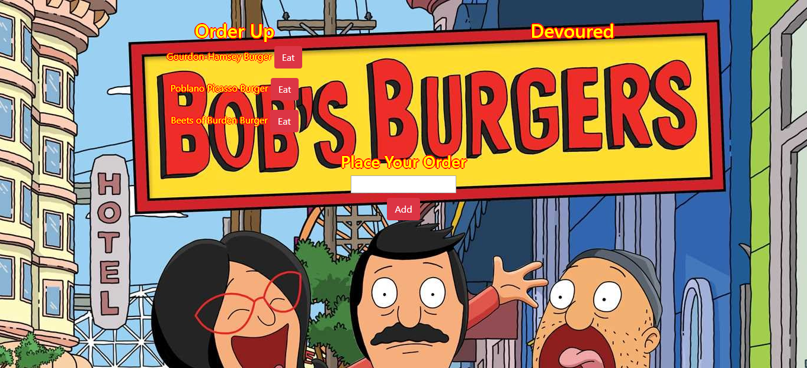

# Burger

The objective of this project was to create an all important burger logger.  In order to achieve this objective, node, express and mysql were used to query and route data that was then displayed with handlebars. A link to the working application can be found below.   

https://cryptic-tundra-47803.herokuapp.com/
